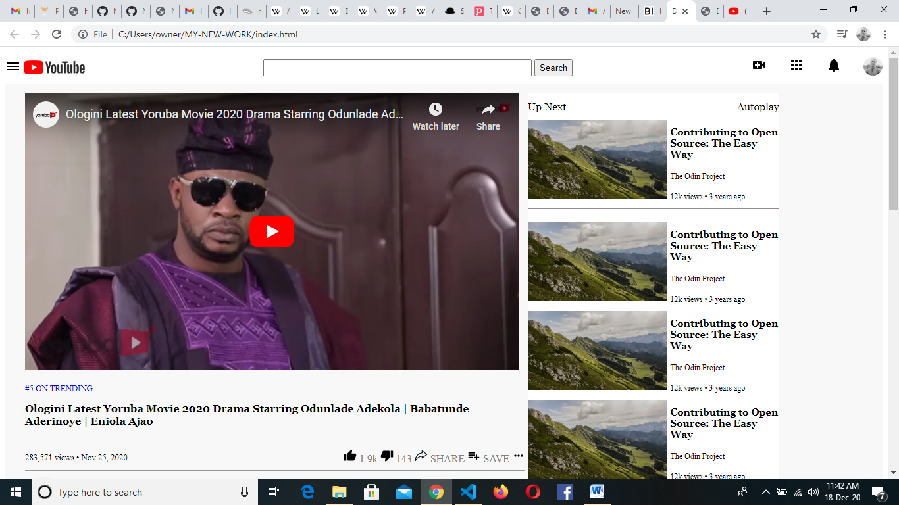

# Youtube Clone

This is a clone copy of Youtube page.
   

The aim of this project is to produce an exact replica of the Youtube page.

## Built with
  * HTML 
  * CSS 
  
## Live demo
[Live Demo Link](https://rawcdn.githack.com/Habidoye97/MY-NEW-WORK/b64c605372693361c2c6910cb46570d1bb63bea5/index.html)

## Getting started
**I created a cloned copy of [Youtube](https://www.youtube.com/watch?v=5L_0FI7IOwQ) homepage. The main aim is use this project to learn basics of HTML/CSS.**

I used the browser’s developer tools to inspect the youtube website to understand how elements are placed and styled.
I built my own page in a .html text file and opened it in our browser to check it out. I carried out the following steps:
  - First setup a github repository for the project.
  - Then create a .html file where all our HTML markup will go
  - Create a .css file where all our styling code will reside
  - Then open the [web page](https://www.youtube.com/watch?v=5L_0FI7IOwQ), inspect its features with browser's developer tools and start creating  :shipit:

## Author
 * Github: https://github.com/Habidoye97/
 

## Contributing
Contributions, issues and feature requests are welcome!

   1. Fork the Project
   2. Create your Feature Branch (git checkout -b feature/AmazingFeature)
   3. Commit your Changes (git commit -m 'Add some AmazingFeature')
   4. Push to the Branch (git push origin feature/AmazingFeature)
   5. Open a Pull Request

Feel free to check the [issues page](https://github.com/Habidoye97/MY-NEW-WORK/issues).

## Show your support
Give a :star: if you like this project!

## Acknowledgements
  
  * [The Odin Project](https://www.theodinproject.com/courses/html5-and-css3/lessons/embedding-images-and-video#introduction)

## License
 Distributed under the MIT License.